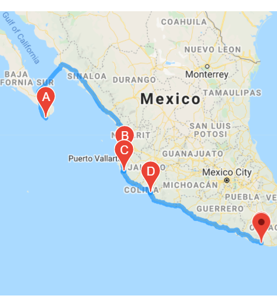
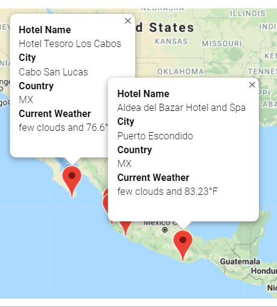

# World_Weather_Analysis

# Overview
* The purpose of this analysis was to indentify weather patterns within different geographical regions to determine the best vacation route.

# Results
* The analysis showed 184 cities with hotels that fit the prefered weather conditions and 5 cities in Mexico were chosen for the final itinerary destination.
* This itinerary was made mapping out the best route to the hotels and in addition it showed the current weather for those cities.

# Summary
* The analysis was performed using API's to extract the current weather for over 700 locations with only 184 hotels meeting the predetermined temperature criteria.
* 5 hotels were chosen in Mexico for the final itinerary.
